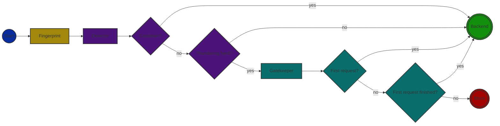

# Anicetus

[](https://pkg.go.dev/github.com/rafaeljusto/anicetus)


The [thundering herd problem](https://en.wikipedia.org/wiki/Thundering_herd_problem)
is a performance problem that occurs when a large number of processes or threads
wake up at the same time and compete for a limited resource.

This project attempts to resolve this by detecting the sittuation, and only
allowing a single request to pass through to the resource, while the others are
blocked. Once the resource is available, the blocked requests are released. The
reason is that allowing a single request to finish first creates a caching
effect, and the other requests can be served from the cache.

Out of the box, a web server (`anicetus-http`) is provided as a micro-service
for your network, but this library can be used in any Go project to plug-in with
an existing solution.

## Design



There are some key concepts for this project that will be explained in the next
sections.

### Fingerprint

The fingerprint is a unique identifier for the request. It is used to identify a
group of requests that are considered the same. For example, in a web
application, depending on the use case, the fingerprint could be the URL, some
specific HTTP headers, or a combination of both.

Allowing to configure how the fingerprint is generated gives the flexibility to
target specific users or not.

> [!IMPORTANT]
> Defining the correct fingerprint that matches the backend caching group is
> crucial for this solution to work. If the backend application cannot cache the
> incoming requests from the group of requests identified by the fingerprint,
> the thundering herd will still be a problem.

### Detector

Once the fingerprint is generated, the detector will check if there are other
requests with the same fingerprint. Different algorithms can be used to detect a
thundeting herd, and this library provides the
[token bucket](https://en.wikipedia.org/wiki/Token_bucket) out-of-the-box. When
using the token bucket algorithm the detector needs to know how many same
fingerprint occurences are allowed in a time window.

After the thundering herd is handled, the detector will stop analysing the
requests for a while (cooldown period). This is to avoid the thundering herd to
be detected again in a short period of time. The cooldown period shoud be
configured taking the stale cache risk of the backend into account.

### Gatekeeper

After a thundering herd is detected, the gatekeeping will allow the first
request to pass through, and block the others. The blocked requests will be
allowed to hit the backend once the first request execution is done.

> [!IMPORTANT]
> The backend MUST create a cache response for requests with the same
> fingerprint to avoid the thundering herd to hit the infrastructure.

## Library

The library is the core of the project. It provides the necessary functions to
be used in any Go project. The library is designed to be flexible so you can
implement your own detector and gatekeeper storage.

```go
package main

import (
  "context"
  "net/http"
  "time"

  "github.com/rafaeljusto/anicetus"
  "github.com/rafaeljusto/anicetus/detector"
  "github.com/rafaeljusto/anicetus/storage"
)

func main() {
  detector := detector.NewTokenBucketInMemory(
    detector.WithLimitersBurst(1000),
    detector.WithLimitersInterval(time.Minute),
    detector.WithCoolDownInterval(10*time.Minute),
  )

  gatekeeperStorage := storage.NewInMemory()

  anicetus := anicetus.NewAnicetus[fingerprint.HTTPRequest](detector, gatekeeperStorage)

  // ...
}
```

## FAQ

You will find here some common questions and answers.

**Q: Is this a load balancer?**

A: No, this is not a load balancer. This is a simple solution to the thundering
herd problem.

**Q: Does it cache the responses?**

A: No, it does not cache the responses. It only allows a single request to pass
through. It's the responsibility of the backend application to cache the
responses and serve them from the cache. This solution will just give enough
time for the cache to be populated.

**Q: Why Anicetus?**

A: Anicetus comes from the Greek word Ἀνίκητος (Aníkētos, literally
"Unconquerable"). A god and one of the guardians and gatekeepers of the gates of
Mount Olympus. It's a metaphor for the protector of the backend application.