# Example

In this example we will show how a web application can be protected from a
thundering herd.

```mermaid
graph TD;
  Internet("🌎")-->Anicetus;
  Anicetus-->Backend["Backend Application"];
```



The Backend Application is only a dummy backend that adds some contention
according to the amount of the API requests it receives, timing out after 5
seconds. The Thundering Herd is a proxy that will protect the Web Application
from thundering herds by only allowing a single request to be processed at a
time.

To execute the example it will require the
[docker engine](https://docs.docker.com/engine/install/) to be
installed. The example can be executed by running the following command:

```shell
docker-compose up --build
```

After the containers are up and running, you will see something like the
following in the logs (the time was simplified for better readability):

```
backend         | {"time":"10:56:39","level":"INFO","msg":"starting web server","address":"[::]:80"}
anicetus  | {"time":"10:56:39","level":"INFO","msg":"starting web server","address":"[::]:80"}
backend         | {"time":"10:56:44","level":"INFO","msg":"stats","requests":11,"timeouts":0,"success":0,"cached":0}
backend         | {"time":"10:56:49","level":"INFO","msg":"stats","requests":10,"timeouts":11,"success":0,"cached":0}
backend         | {"time":"10:56:54","level":"INFO","msg":"stats","requests":10,"timeouts":10,"success":0,"cached":0}
backend         | {"time":"10:56:59","level":"INFO","msg":"stats","requests":10,"timeouts":10,"success":0,"cached":0}
backend         | {"time":"10:57:04","level":"INFO","msg":"stats","requests":10,"timeouts":10,"success":0,"cached":0}
anicetus  | {"time":"10:57:08","level":"WARN","msg":"thundering herd detected: processing single request","method":"GET","path":"/","fingerprint":"76b0f268b4c22dc6ef8b449ab03892ea3247ed2c38a73ab422bf7b18c159ad15"}
backend         | {"time":"10:57:09","level":"INFO","msg":"stats","requests":10,"timeouts":10,"success":1,"cached":0}
backend         | {"time":"10:57:14","level":"INFO","msg":"stats","requests":10,"timeouts":9,"success":0,"cached":10}
backend         | {"time":"10:57:19","level":"INFO","msg":"stats","requests":10,"timeouts":0,"success":0,"cached":10}
backend         | {"time":"10:57:24","level":"INFO","msg":"stats","requests":10,"timeouts":0,"success":0,"cached":10}
backend         | {"time":"10:57:29","level":"INFO","msg":"stats","requests":10,"timeouts":0,"success":0,"cached":10}
backend         | {"time":"10:57:34","level":"INFO","msg":"stats","requests":10,"timeouts":0,"success":0,"cached":10}
```

You notice that the backend is receiving 10 requests every 5 seconds (log
interval) because the client is sending 2 queries per second. The thundering
herd tool allows consuming all the 60 available requests in the minute, and
detects the anomaly after it. After that only a single request proceed, and once
it's cached you noticed that the tool allows all requests to be processed again.
As now the request is cached everything suceeds.

Press Ctrl+C to stop the containers. And the following command should tear down
the infrastructure:

```shell
docker-compose down
```